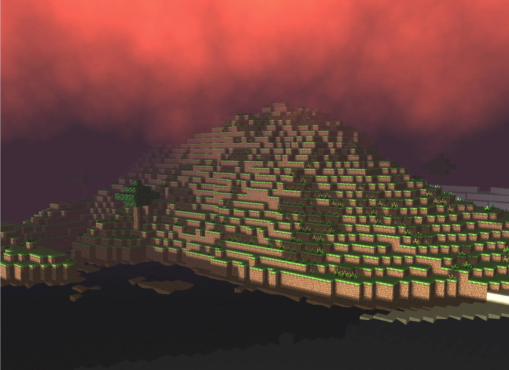
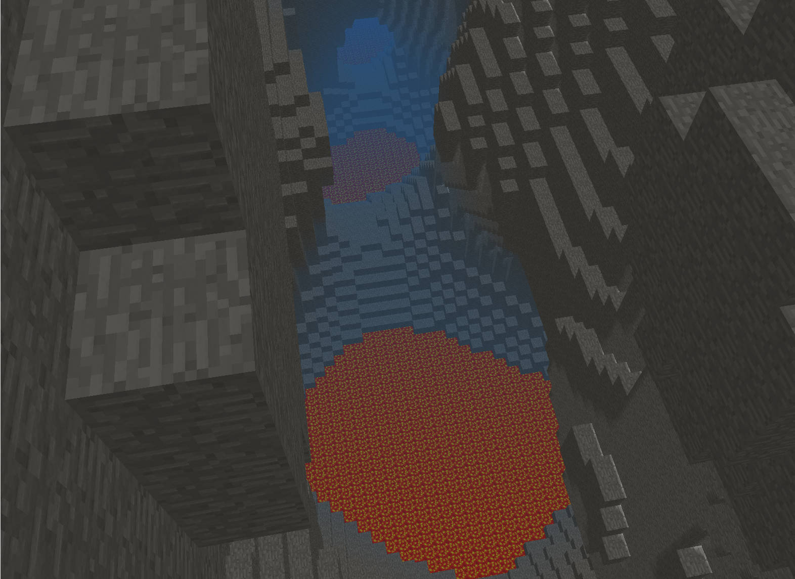
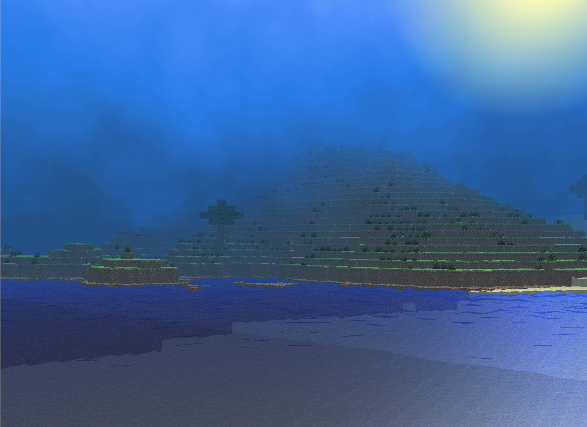
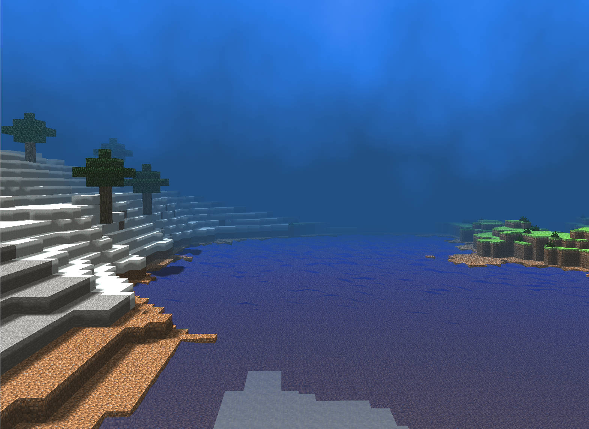
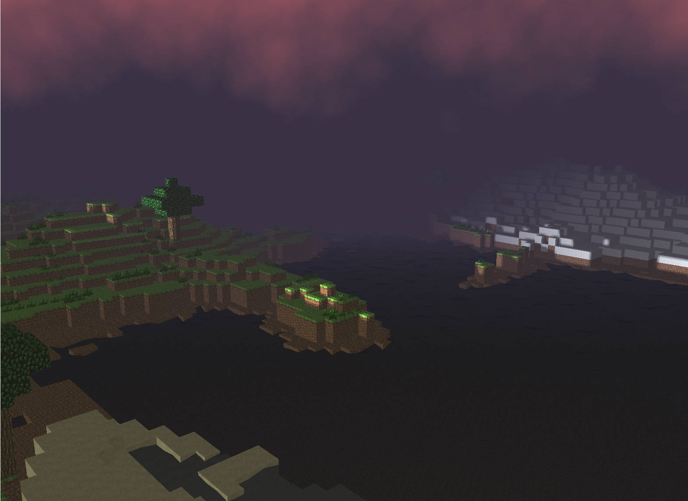
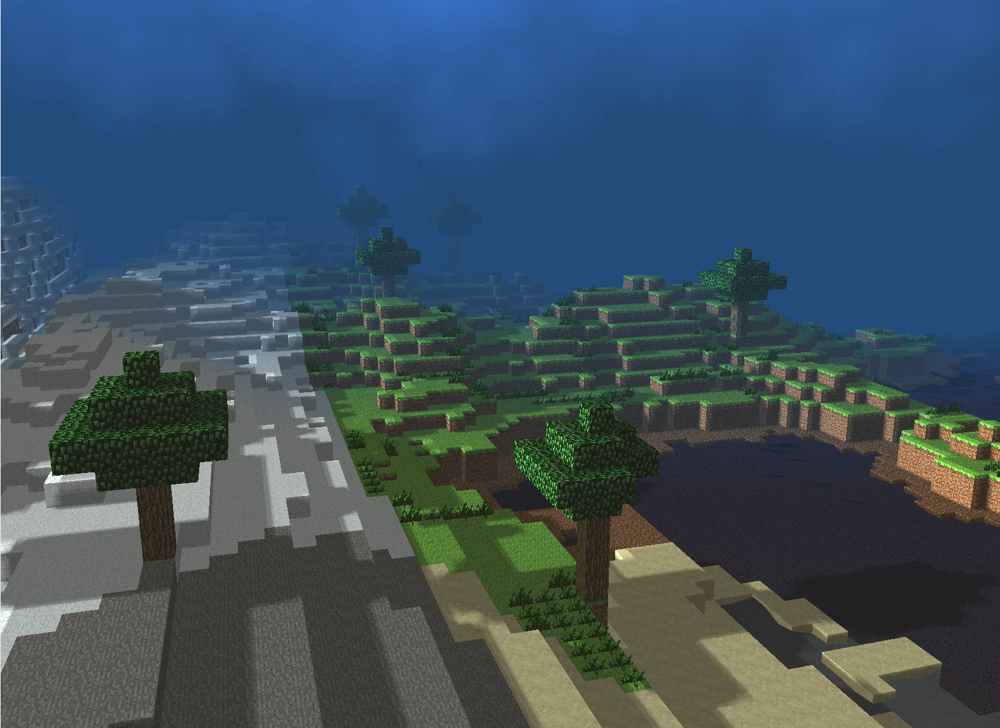

# Mini-Minecraft

# My Part

# Milestone1

  
 Specifications 

  

## Efficient Terrain Rendering and Chunking (Keqi Wu)
**Chunk Inherited from drawable**

The primary goal is to accumulate VBO (Vertex Buffer Object) data for a chunk and store this data in memory to facilitate rendering. In the process of gathering VBO data, only the faces of opaque blocks that are adjacent to empty spaces (air) are considered for rendering. This entails appending the vertices, normals, colors, and UV coordinates of these faces to the VBO data. For blocks situated at the boundaries of a chunk, adjacent chunks are consulted to determine the status of blocks neighboring those at the edge.

**Interleaved VBO Data**

Given that the setup includes just a single buffer array besides the index buffer array, it's necessary only to use generateBuffer() along with POSITION, NORMAL, COLOR. Following this, the buffer data should be linked with POSITION, NORMAL, COLOR. Within shaderprogram.cpp, the addition of a drawInterleaved(Drawable &d) function facilitates the drawing of the buffer. This function details the starting points for each type of data—position, normal, color, UV coordinates—and outlines the stride required for accurately accessing each piece of information.

**Terrain expansion**

During each update cycle, the program verifies if the 81 chunks around the player, forming a 9 x 9 chunk area, have been initialized and whether their VBO data has been generated. If any chunks have not been created or their VBO data is missing, the program proceeds to instantiate these chunks and generate the necessary VBO data. There's a specific member variable, named m_ChunkVBOs, responsible for holding the VBOs of all chunks that are currently loaded. Within the draw function, there's a loop that traverses this chunk, rendering each chunk for which VBO data exists.

# Milestone2

  
 Specifications 

## Cave Systems & Multithread(currently got issue here) (Keqi Wu)
* **Caves Generation**: 3d Perlin Noise was used to generate the cave systems, which are uniformly distributed beneath the entire surface terrain. If the noise value returned by getCaveHeight(x,y,z) is less than zero, we place STONE blocks; otherwise, we place LAVA or EMPTY blocks based on height.
*  **Collision Detection**: To prevent collisions with transparent objects, we do not set the velocity to zero if the hit block is transparent (WATER, LAVA).
*  **Post Processing**: Added color offset when under water and lava.
*  **multithread**: Also tried to implement another version of Multithread, containing some thread designing issues that cause crashes randomly. The terrain can be generated on my machine but not on team members machine (on MS1). When migrate to MS2, the program crashes.

# Milestone3

  
 Specifications 

## Day and night cycle & Post-process Camera Overlay & Water Wave (motion part) (Keqi Wu)

* **Day and night cycle**: Sky GLSL fragment shader crafts a dynamic sky environment by altering light and color based on the sun's continually changing position. Utilizing an inverse view projection matrix, it transforms screen coordinates to world coordinates, establishing the foundation for simulating atmospheric effects. The shader calculates ray directions from the camera, essential for rendering the light scattering across the sky. Worley noise generates animated, realistic cloud textures, contributing depth and movement to the sky. Sphere-to-UV mapping is employed to apply these textures onto a simulated spherical dome, enhancing the visual impression of a curved atmosphere. Color transitions are meticulously handled, shifting between distinct palettes for noon, sunset, and dusk based on the sun's elevation and angle relative to the observer. This blending is tuned to reflect the sun's position, with special effects like a glowing sun that dynamically changes in appearance and intensity. The result is a visually compelling sky simulation that enhances the realism and depth of 3D scenes, making the shader integral to immersive outdoor environments.
  
* **Water Wave (motion part)**: The vertex shader simulates water wave motion on geometry marked as "animated" by utilizing vertex attributes. This effect is achieved by applying a sine and cosine function to the world-space coordinates (x, z) of each vertex. The amplitude and frequency of the waves are varied by using a noise function based on the vertex position, creating a more natural and less uniform appearance. The calculated wave offsets the y-coordinate of the vertex position, giving the impression of undulating water. The shader ensures the adjustments are perspective-correct by scaling the offset by the w-component of the clip space position, enhancing the realism of the effect.

* **Post-process Camera Overlay**: The water GLSL fragment shader simulates a dynamic water effect by blending textural data with procedural noise. It retrieves color from an albedo texture and modifies it using a fractal brownian motion (fbm) function, which applies cubic interpolation for noise generation across three-dimensional space. This noise influences the texture's brightness, simulating light interaction with moving water surfaces. Additionally, the shader creates a shimmering effect using a complex trigonometric transformation, enhancing the water's visual complexity. This combination of texture manipulation and procedural generation creates a realistic and dynamic water overlay. The lava shader simulates fluid flow across surfaces by computing a noise-based distortion field. It uses a noise function to determine the flow direction and intensity at various points, adjusted dynamically by the shader's time variable, simulating natural fluid movement. This is further processed to compute gradients and influence the flow's directionality. The result is visually represented as a color modulation over the albedo texture, adding a sense of depth and motion to the rendered surface, mimicking the appearance of flowing, viscous material.  

# Sample Visual Scene

